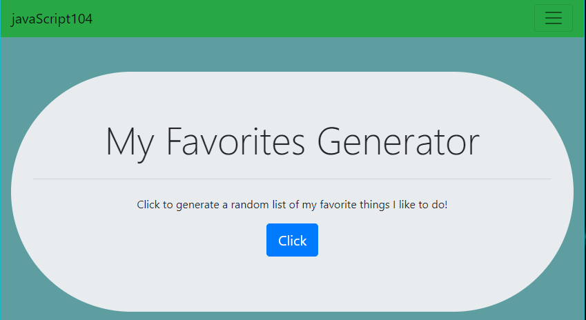
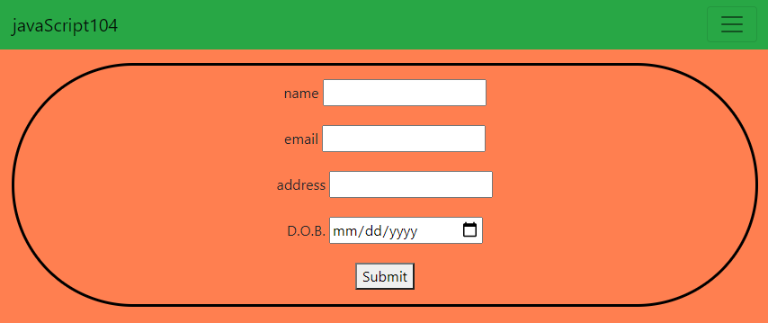
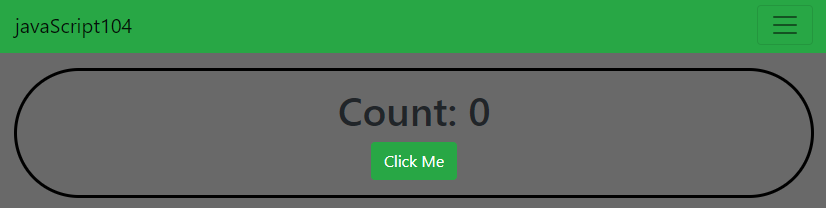

# javaScript104
## Combining javaScript with front-end UI

> This blog post was about understanding how to use Javascript and tie in the front-end UI.

## Home Page

```

    - Brief explanation of each page and gives snip'its as well
    ___________________________________________________________
    - Section I   - Generator Page
    - Section II  - Input Page
    - Section III - Counter Page

```

***SECTION I***



This page was developed with HTML and CSS. I also rendered javaScript and utilized arrays that held on all of my favorite things that I like to do. I developed the page to be simple and slick. The user is prompted with four question and I used the Math.floor and Math.random to bring a randomized list of my favorite things.
- - -

***SECTION II***



On this page I practiced leveraging an open source design library called Bootstrap. I wanted to create a simple form that a user could input actual information. Even though the user's information is not stored in local storage, it's main purpose is that it has the capability for user interaction. Within this page a user can do just that.
- - -

***SECTION III***



On the counter page a user can go and button smash their mouse as many times as they want to. It was mainly developed for basic javaScript purposes, but then I turned it into a stress reliever. Every time I was not able to complete a task, I would just take my frustration out on the counter!
- - -

## LINKS

- [javaScript104 Link](https://nicholasd-uci.github.io/javaScript104/)
- [GitHub Repo Link](https://github.com/nicholasd-uci/javaScript104)
- [Nicholas Dallas GitHub](https://github.com/nicholasd-uci)

- - -
© 2020 NPRD, Nicholas Paul Ruiz Dallas